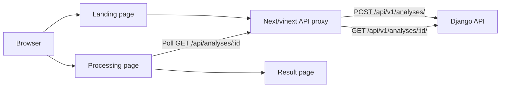

<p align="center">
  
</p>

# CekDulu Frontend

[](https://github.com/OweCode-id/CekDulu-frontend/actions/workflows/ci.yml)


> **Cek dulu sebelum checkout.**

CekDulu is an evidence-oriented shopping assistant built during a three-day
hackathon. A user submits a Tokopedia product URL, follows the analysis job in
real time, and receives a structured report containing risk signals,
counter-signals, confidence, limitations, and practical follow-up actions.

This repository contains the web experience. The asynchronous collector,
scoring engine, and API live in the
[CekDulu backend repository](https://github.com/OweCode-id/CekDulu-backend).

## Why CekDulu?

Marketplace pages contain many signals, but buyers often need to interpret
them quickly: an unusual price, inconsistent product details, sparse reviews,
or a store with limited public reputation. CekDulu turns the public evidence
that could be collected into a report that is easier to inspect.

CekDulu reports **indications of risk**, not a probability of fraud. It does
not guarantee that a transaction is safe and does not label a seller as a
scammer.

## User flow

1. Paste a public Tokopedia product URL on the landing page.
2. The frontend creates an asynchronous analysis job through its server-side
   API proxy.
3. The processing page polls the backend and reflects the real job state.
4. When the job finishes, the user is redirected to the evidence report.
5. The report separates the score, confidence, risk signals,
   counter-signals, limitations, and suggested next checks.

## Implemented features

- Tokopedia URL input with client-side validation and clipboard paste.
- Responsive landing, processing, result, and failure states.
- Server-side proxy routes for creating and polling analysis jobs.
- Live polling for `queued`, `collecting`, `analyzing`, `completed`, and
  `failed` states.
- Risk score and confidence displayed as separate concepts.
- Findings grouped into Price, Review, Store, and Listing views.
- Product image from the collected Tokopedia evidence, with a visual fallback.
- Clear limitations and neutral, non-accusatory result language.
- Open Graph metadata, favicon, responsive styling, keyboard focus states,
  and reduced-motion support.

## Architecture



The browser talks to local route handlers under `app/api/`. Those handlers
forward requests to Django, keeping the backend base URL on the server side
and avoiding a direct cross-origin browser dependency.

## Tech stack

| Area | Technology |
| --- | --- |
| UI | Next.js 16, React 19, TypeScript |
| Styling | Tailwind CSS 4, PostCSS, project CSS |
| Runtime/build | vinext, Vite, Cloudflare Vite plugin |
| Quality | ESLint, TypeScript compiler, GitHub Actions |

## Try it locally

### Prerequisites

- Node.js `22.13.0` or newer.
- npm.
- For a real analysis: the Django API, Redis, Celery worker, and Playwright
  collector from the backend repository must also be running.

### 1. Clone and install

```bash
git clone https://github.com/OweCode-id/CekDulu-frontend.git
cd CekDulu-frontend
npm ci
```

### 2. Configure the backend URL

Create `.env.local` in the repository root:

```env
CEKDULU_API_BASE_URL=http://127.0.0.1:8080
```

`CEKDULU_API_BASE_URL` is preferred because the value is only needed by the
server-side proxy. If it is omitted, the current local default is also
`http://127.0.0.1:8080`.

### 3. Start the frontend

```bash
npm run dev
```

Open [http://localhost:3000](http://localhost:3000). The landing page can be
explored on its own, but submitting a live analysis requires the full backend
stack.

### 4. Start the full analysis stack

Follow the backend repository's
[local setup guide](https://github.com/OweCode-id/CekDulu-backend#try-it-locally)
to start Redis, Django on port `8080`, and the Celery collection worker. Then
submit a public Tokopedia product URL from the CekDulu landing page.

## Available scripts

| Command | Purpose |
| --- | --- |
| `npm run dev` | Start the development server on port `3000`. |
| `npm run build` | Create a production build. |
| `npm run start` | Run the built application locally. |
| `npm run lint` | Run ESLint. |
| `npm run typecheck` | Run TypeScript without emitting files. |
| `npm test` | Validate the project by running the production build. |

`npm test` is currently a build verification command; this prototype does not
yet include a dedicated unit or end-to-end test suite.

## Project structure

```text
app/
├── api/analyses/       # Server-side proxy to Django
├── analisis/           # Live processing page
├── hasil/              # Evidence report page
├── components/         # Shared product, score, header, and footer UI
├── lib/                # API types, polling helpers, display utilities
├── layout.tsx          # Metadata and root layout
└── page.tsx            # Landing page
public/                 # Brand, social preview, mascot, and static assets
worker/                 # Cloudflare Worker entry used by the Vite setup
```

## Continuous integration

GitHub Actions runs on pushes and pull requests and performs:

1. `npm ci`
2. `npm run lint`
3. `npm run typecheck`
4. `npm run build`

## Current limitations

- A live report depends on Django, Redis, Celery, Playwright, and Tokopedia
  being reachable.
- Product and store display names are currently derived from URL slugs in a
  few frontend views instead of always using normalized backend evidence.
- Finding categories are inferred from signal codes in the current API
  contract.
- The example report on the landing page is explicitly illustrative data.
- vinext and Cloudflare build configuration are present, but this repository
  does not include a one-click deployment workflow.
- Marketplace markup and availability can change, so collection may fail or
  return incomplete evidence.

## Responsible use

CekDulu only presents indications derived from public data that the collector
could access. It does not bypass CAPTCHA, login walls, or access restrictions.
The report is decision support, not a guarantee of safety or a definitive
accusation against a product or seller.

## Related repository

- [CekDulu Backend](https://github.com/OweCode-id/CekDulu-backend) — Django
  REST API, Celery/Redis jobs, Playwright collection, deterministic scoring,
  and optional OpenRouter explanations.
